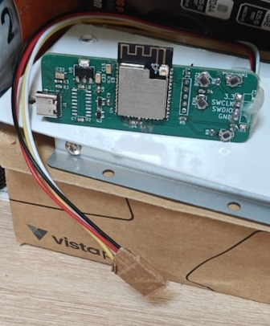
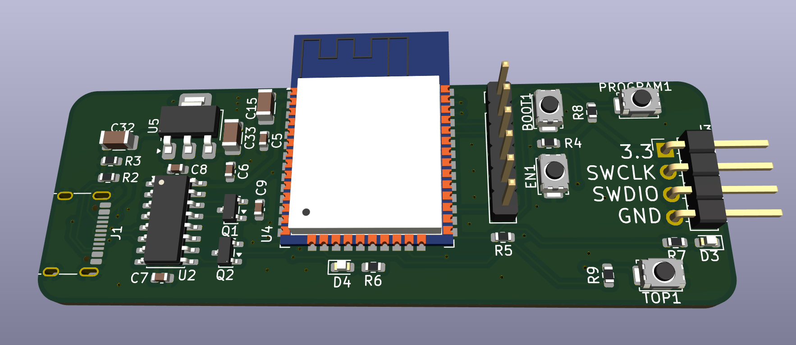
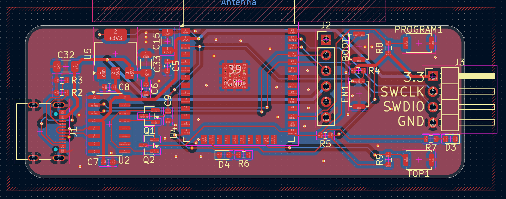
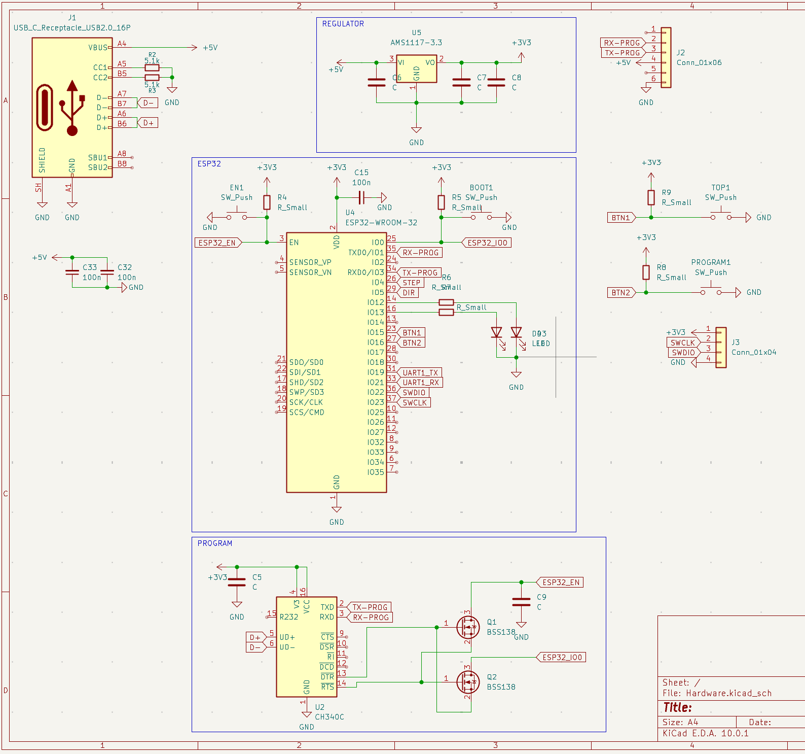

# OverWire

**Cut the cord, keep the control.** 
OverWire is a specialized, open-source hardware bridge designed to liberate your STM32 development process. By coupling a powerful ESP32-WROOM-32 module with a dedicated SWD (Serial Wire Debug) interface, OverWire allows you to flash and debug STM32 targets completely wirelessly.

Whether your target is locked inside an enclosure, mounted on a moving robot, or just sitting across the room, OverWire brings the programming interface directly to you over Wi-Fi.

### Real

---
## Features

* **ESP32 at the Core:** Powered by the robust ESP32-WROOM-32 module, providing reliable 2.4 GHz Wi-Fi and Bluetooth connectivity for Over-The-Air (OTA) target flashing.
* **Dedicated SWD Port:** A clean 4-pin header (`3.3V`, `SWCLK`, `SWDIO`, `GND`) ready to hook directly into your STM32 target.
* **USB Type-C Interface:** Modern USB-C connector backed by a CH340C USB-to-UART bridge for painless initial flashing and serial debugging of the ESP32 itself.
* **Auto-Program Circuit:** Features the standard dual-BSS138 (DTR/RTS) auto-reset circuit, meaning you don't need to hold down buttons to flash the ESP32.
* **On-Board LDO:** AMS1117-3.3V regulator safely steps down the 5V USB power to a stable 3.3V for the ESP32 and SWD target.
* **Tactile Control:** Includes `EN` and `BOOT` buttons for the ESP32, plus two programmable user buttons (`TOP1`, `PROGRAM1`) mapped to `IO15` and `IO16` for custom firmware triggers.
* **Status LEDs:** Two user-controllable LEDs mapped to `IO12` and `IO13` for quick visual feedback (e.g., Wi-Fi connected, Flashing target, Error).

## Pinout & Connections

### Target SWD Interface (J3)
| Pin | Name | Description |
| :--- | :--- | :--- |
| 1 | **+3V3** | 3.3V Power Output to target (from AMS1117) |
| 2 | **SWCLK** | Serial Wire Clock (Connects to ESP32) |
| 3 | **SWDIO** | Serial Wire Debug Data I/O (Connects to ESP32) |
| 4 | **GND** | Common Ground |

### Extension / Debug Header (J2)
Provides access to `5V`, `GND`, and the ESP32 UART (`TX-PROG`, `RX-PROG`) for external communication or secondary programming.

## Gallery

### 3D Render

### PCB Layout

### Schematic

## Getting Started

1. Connect OverWire to your PC via a USB Type-C cable.
2. Flash the ESP32 with your preferred wireless SWD firmware (such as a Wi-Fi BlackMagic Probe port or custom TCP-to-SWD bridge).
3. Connect the `J3` SWD header to your STM32 target.
4. Connect to the ESP32 over Wi-Fi and start flashing your STM32 remotely!

---

## License

This hardware design is released under the **Creative Commons Attribution-NonCommercial 4.0 International** (CC BY-NC 4.0) license. 
You are free to view, use, and modify this design for **personal, non-commercial** purposes only. You may **not** use this material for commercial purposes (such as manufacturing and selling the boards) without explicit written permission from the original author.

*Designed with KiCad.*